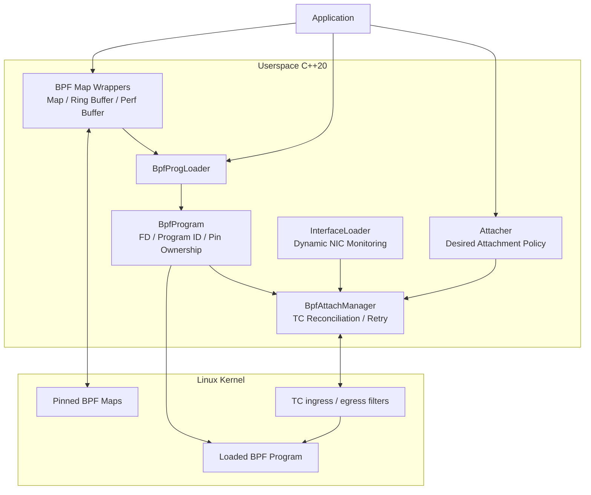
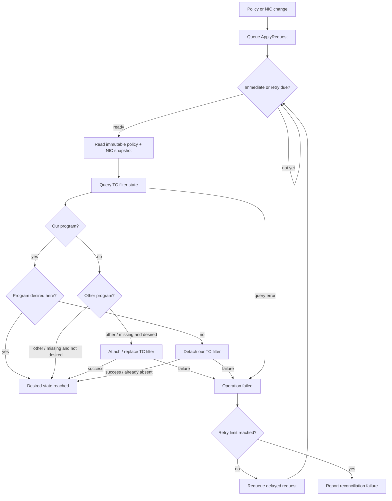

# libbpf-control-cpp

C++20 utilities for managing **libbpf maps, BPF programs, Linux TC attachments, and dynamic network interfaces**.

The project provides a small C++ layer around recurring eBPF userspace lifecycle problems rather than trying to hide libbpf itself.

> **Status:** Experimental / under active development.

## Overview

`libbpf-control-cpp` is organized around four main responsibilities:

- BPF map / ring buffer / perf buffer management
- BPF object loading and pinned-map reuse
- desired TC attachment policy management
- reconciliation between desired policy and actual kernel TC state

The current `main.cpp` and `tc_bpf/` program are **examples** showing how the utilities can be used. They are not required by the core design.

## Architecture



## Components

### BPF map wrappers

The map-control layer wraps common userspace operations for BPF maps and event buffers.

Available components include:

- `BpfMapControl`
- `BpfRingBufferControl`
- `BpfPerfBufferControl`

Pinned maps can be opened and reused by userspace code instead of being recreated on every process start.

### `BpfProgLoader`

`BpfProgLoader` loads a compiled BPF object and prepares a program for userspace ownership.

Its responsibilities include:

- opening a BPF object file
- selecting a program by function name
- assigning the BPF program type
- connecting BPF object maps to existing pinned maps with `bpf_map__reuse_fd()`
- loading the object into the kernel
- obtaining an independent program FD and program ID
- pinning the program
- recording pin ownership

Example:

```cpp
std::vector<BpfBase*> pinned_maps {
    &mirror_map,
    &monitor_map,
    &monitor_ringbuf
};

auto [program, error] = BpfProgLoader::load_program(
    "tc_mirroring.o",
    "tc_mirroring",
    pinned_maps
);

if (error != BpfProgLoaderError::kNoError) {
    // handle error
}
```

### `BpfProgram`

`BpfProgram` represents a loaded kernel BPF program.

It stores:

- duplicated program FD
- kernel program ID
- program type
- function name
- section name
- pinned path
- pin ownership

The duplicated FD is released automatically when the `BpfProgram` object is destroyed.

A program pin is removed during normal destruction only when the current `BpfProgram` instance owns that pin.

### `Attacher`

`Attacher` describes **desired attachment state** rather than directly modifying TC state.

Supported modes:

```cpp
AttachMode::kAttachSelective
AttachMode::kAttachAll
```

Example:

```cpp
auto& manager = BpfAttachManager::get_instance();

auto attacher = manager.create_attacher(
    program,
    {
        .priority = 100,
        .handle = 1,
        .is_ingress = true
    }
);

attacher->add_target("eth0");
attacher->add_target("eth1");
```

Policy updates are exposed to the manager through immutable snapshots.

### `BpfAttachManager`

`BpfAttachManager` reconciles the desired attachment policy with the current TC state.

It reacts to both:

- `Attacher` policy changes
- network-interface changes reported by `InterfaceLoader`

TC queries distinguish four states:

```cpp
enum class FilterState {
    kOurProgram,
    kOtherProgram,
    kNotFound,
    kError
};
```

This avoids treating a missing filter as an operational error.

## TC Reconciliation



Apply requests are coalesced by attacher ID. A newer request replaces an older queued request for the same attacher, preventing stale retries from taking priority over a more recent policy update.

## Dynamic Interface Handling

`InterfaceLoader` maintains a snapshot of available network interfaces and monitors link/address changes.

When the interface set changes, attachment policies are scheduled for reconciliation again so that TC state can follow interface hotplug or recreation.

## Example Code

The repository currently contains a mirroring / monitoring example:

```text
src/main.cpp

tc_bpf/
├── tc_mirroring.c
├── tc_comm.h
└── vmlinux.h
```

The example demonstrates:

- opening or creating pinned maps
- loading a BPF program with reused maps
- creating an `Attacher`
- attaching to selected interfaces
- ring-buffer polling
- simple TC mirroring / monitoring

The example-specific interface names, object paths, and map names should not be treated as library defaults.

## Project Structure

```text
.
├── include/
│   ├── bpf_map_control/
│   │   ├── bpf_control_base.hpp
│   │   ├── bpf_map_control.h
│   │   ├── bpf_perf_buffer_control.h
│   │   └── bpf_ring_buffer_control.h
│   │
│   ├── bpf_tool/
│   │   ├── bpf_attach_manager.h
│   │   ├── bpf_attacher.h
│   │   ├── bpf_prog_loader.h
│   │   └── bpf_types.hpp
│   │
│   └── nic_check/
│       └── interface_loader.h
│
├── src/
│   ├── bpf_map_control/
│   ├── bpf_tool/
│   ├── nic_check/
│   └── main.cpp          # example application
│
└── tc_bpf/               # example BPF program
    ├── tc_mirroring.c
    ├── tc_comm.h
    └── vmlinux.h
```

## Requirements

- Linux
- C++20-compatible compiler
- CMake 3.16 or newer
- libbpf
- pthread
- clang with BPF target support for the included example
- kernel eBPF / TC support
- bpffs when using pinned BPF objects

The included BPF example is currently compiled with:

```text
-target bpf
-mcpu=v3
-O2
```

## Build

```bash
git clone https://github.com/Inkiiee/libbpf-control-cpp.git
cd libbpf-control-cpp

cmake -S . -B build -DCMAKE_BUILD_TYPE=Release
cmake --build build -j
```

The current CMake configuration builds the userspace example together with the sample TC BPF object.

## Yocto / Cross Compilation

The build supports the `SDKTARGETSYSROOT` environment variable commonly provided by Yocto SDK environments.

```bash
source /path/to/environment-setup-<target>

cmake -S . -B build -DCMAKE_BUILD_TYPE=Release
cmake --build build -j
```

The configured SDK target sysroot is used for userspace include/library lookup and for the sample BPF build include path.

## Current Limitations

This project is still experimental.

Current limitations include:

- attachment reconciliation uses a bounded retry count
- persistent reconciliation failures are not retried indefinitely
- a program pin left behind after abnormal process termination requires explicit recovery before loading another program at the same path
- an existing TC program at the same handle / priority may be replaced during reconciliation
- the repository currently builds an example executable rather than exposing a packaged installable CMake library target
- `main.cpp` and `tc_bpf/` contain example-specific paths, interfaces, and behavior

## Design Goals

The project intentionally keeps libbpf concepts visible.

The goal is to provide reusable C++ ownership and lifecycle primitives around:

```text
BPF map lifetime
        +
pinned-map reuse
        +
BPF program lifetime
        +
TC desired state
        +
network interface changes
        +
retry / reconciliation
```

It is intended as a lightweight utility layer, not as a replacement for libbpf.

## License

This project is licensed under the [MIT License](LICENSE).

Third-party dependencies, including libbpf and Linux/kernel headers or generated artifacts, remain subject to their respective upstream licenses.
